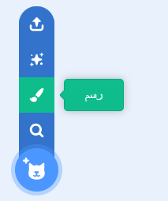
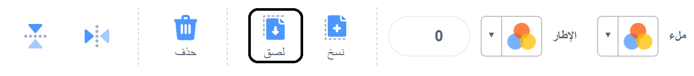

## البناء والاختبار

الآن حان وقت إنشاء المحاكاة الخاصة بك. ابدأ بالتفكير في خلفية المحاكاة الخاصة بك. هل ستكون متحركة أم ثابتة؟


**نصيحة**: تذكر أن تختبر مشروعك في كل مرة تضيف شيئا. من السهل جدًا العثور على الأخطاء وإصلاحها قبل إجراء المزيد من التغييرات.

--- task ---

اختر خلفية لاستخدامها في المحاكاة الخاصة بك. يمكن أن تكون الخلفية ثابتة، أو يمكنك جعلها متحركة.

--- collapse ---
---
title: تحريك الخلفية
---

بدلا من تحريك الخلفية، في الواقع، ستقوم بتحريك الكائن الذي قمت بإنشائه عن طريق نسخ الخلفية.

قم بإنشاء كائن عن طريق نسخ الصور في الخلفية، ثم قم بإضافتها إلى الكائن الخاص بك.





قم بإنشاء `متغير` جديد {:class='block3variables'} يدعى `scroll_x`{:class='block3variables'}.

التعليمات البرمجية التالية ستقوم بإنشاء تأثير التحريك على الكائن عندما تقوم بتحريك الفأرة ( الماوس) يميناً ويساراً.

```blocks3
when flag clicked
go to x: (0) y: (0)
create clone of (myself v)
set [scroll_x v] to (0)
forever
if <(mouse x) > (200)> then
change [scroll_x v] by (5)
end
if <(mouse x) < (-200)> then
change [scroll_x v] by (-5)
end
go to x: ((scroll_x v) mod (480)) y: (0)

when I start as a clone
forever
go to x: ((scroll_x v) mod (-480)) y: (0)
```

**نصيحة** بدلا من استخدام موضع الفأرة، يمكنك استخدام النقر على الأزرار أو الضغط على المفتاح لتغيير المتغير `scroll_x`{:class='block3variables'}.

--- /collapse ---

--- /task ---

--- task ---

فكر في الكائنات التي ستستخدمها في المحاكاة الخاصة بك. هل سيبقى بعضها في المشهد، هل ستتغير الأزياء أو التأثيرات أو الحركة عند التفاعل معها؟ هل سيقومون بالتحرك عبر الشاشة؟ كيف سيتم السيطرة عليهم إذا تحركوا؟

--- collapse ---
---
title: تحريك كائن بضغطة مفتاح
---

```blocks3
when flag clicked
forever
if <key (left arrow v) pressed?> then
change x by (-10)
end
if <key (right arrow v) pressed?> then
change x by (10)
end
```

--- /collapse ---


--- collapse ---
---
title: انقل كائنًا باستخدام عناصر التحكم على الشاشة
---

قم بإنشاء كائنات متحركة لتوجيهاتك وضعها على الشاشة.


يجب أن تحتوي الأزرار على عناصر تحكم لبث اتجاهها عند النقر فوقها.


```blocks3
when this sprite clicked
broadcast [left v]
```

يجب أن يتحرك الكائن الذي يتم التحكم فيه في الاتجاه المشار إليه. 
```blocks3
when I receive [يسار v]
change x by (-10)
```

--- /collapse ---

--- collapse ---
---
title: تغيير الكائن عند النقر فوقه
---

يمكنك تغيير مظهر واتجاه الكائن عند النقر فوقه. فيما يلي بعض الأمثلة على التعليمات البرمجية.

```blocks3
when this sprite clicked
switch costume to [زي 2 v]

when this sprite clicked
change [color v] effect by (25)

when this sprite clicked
turn cw (30) degrees
```

--- /collapse ---

--- collapse ---
---
title: تحريك كائن بأستخدام الازياء
---

هناك عدة طرق لتحريك كائن ما باستخدام الأزياء الخاصة به. فيما يلي بعض الأمثلة على التعليمات البرمجية.

```blocks3
when flag clicked
forever
next costume
wait (0.2) seconds

When I receive [يمين v]
switch costume to [يمين v]
repeat (3)
next costume
wait (0.2) seconds

When this sprite clicked
repeat (3)
next costume
```

--- /collapse ---

--- collapse ---
---
title: قم بتغيير طبقة الكائن
---

يجب أن تكون الكائنات التي تستخدمها كخلفيات على الطبقة الخلفية. يجب أن تكون الكائنات المتحركة التي تريدها في المقدمة في الطبقة العليا. يمكنك أعداد طبقة الكائن أو استنساخه.

```blocks3
when flag clicked
go to [back v] layer

when I start as a clone
go to [front v] layer
```

--- /collapse ---

--- /task ---

--- task ---

هل سيحتاج أي من الكائنات المتحركة الخاصة بك إلى استنساخ نفسها؟ هل سينتجون العديد من النسخ التي تؤدي حركات مختلفة عندما يبدأون؟

--- collapse ---
---
title: إنشاء نسخ من كائن ما
---
فيما يلي بعض الطرق لإنشاء نسخ وحذفها بعد أحداث مختلفة.

```blocks3
when flag clicked
repeat (20)
create clone of (myself v)

when flag clicked
forever
if <touching (mouse-pointer v)> then
create clone of (myself v)

when I start as a clone
forever
if <touching (edge v)> then
delete this clone
```

--- /collapse ---

--- collapse ---
---
title: قم بترتيب النسخ العشوائية الخاصة بك
---

عندما يتم إنشاء نسخة ، قد تحتاج إلى تعليمات حول كيفية التحرك ، ولكن قد ترغب في أن تتصرف الكائنات المستنسخة المختلفة بشكل مختلف قليلاً. يمكنك استخدام كتلة `random` {: class = 'block3operators'} للقيام بذلك.

```blocks3
when I start as a clone
point in direction (pick random (0) to (359))
forever
move (10) steps
wait (0.1) seconds
if on edge, bounce

when I start as a clone
forever
glide (pick random (1) to (10)) secs to (mouse-pointer v)
```

--- /collapse ---

--- collapse ---
---
title: أحداث لإنشاء نسخة
---

يمكن إنشاء النسخ باستخدام العديد من الأحداث `events`{:class='block3events'}. ستنشئ الكتل البرمجية أدناه نسخة من كائن ما في كل مرة يتم النقر عليها.

```blocks3
when this sprite clicked
create clone of [myself v]
```

يمكنك إنشاء نسخ كلما تم النقر فوق الماوس أيضًا ، وجعل الاستنساخ يظهر في موقع مؤشر الماوس. يمكن أن تظهر الكائنات المستنسخة في أي مكان تريده ، لذلك قد ترغب في نقلها إلى كائن أو موقع معين.

```blocks3
when flag clicked
forever
if <mouse down?> then
create clone of [myself v]

when I start as a clone
go to x: (mouse x) y: (mouse y)
```

--- /collapse ---

--- /task ---

--- task ---

هل سيكون هناك تأثير موسيقي أو صوتي على محاكاتك؟ ربما يكون هناك ضوضاء في الخلفية ، أو يعزف كائن ما لحنًا عند النقر عليه؟

--- collapse ---
---
title: أضافة سكراتش الموسيقية
---

بمجرد إضافة الاضافة (الملحق) ، ستكون كتل جديدة متاحة لك.

هناك ثلاثة عناصر رئيسية يمكن تغييرها داخل هذه الكتل.

- `beats`{:class='block3custom'} هي وحدة زمنية مستخدمة في الموسيقى. يمكن أن تكون النبضة الموسيقية بطول ثانية أو ربع ثانية. الأمر يعود إليك.

- `tempo`{:class='block3custom'} يحدد عدد النبضات في الدقيقة: `60` نبضة في الدقيقة تعني أن كل نبضة في `1` ثانية.

- `note`{:class='block3custom'} هي درجة نغمة النغمة التي يتم عزفها: `60` هي نفس درجة **وسط C** على البيانو.

--- /collapse ---

[[[generic-scratch-sound-from-library]]]

[[[scratch3-record-sound]]]

[[[scratch3-sound-effects]]]

[[[scratch3-reverse-sound]]]

[[[scratch3-crop-sound]]]

--- /task ---

--- task ---

هل تريد أن تستمر كائناتك في تكرار إجراء ما ، حتى يتم استيفاء بعض الشروط؟ يمكنك استخدام كتلة `repeat until`{:class='block3control'} للقيام بذلك.

--- collapse ---
---
title: استخدام كتل كرر حتى (repeat until)
---

فيما يلي مجموعة من الكتل التي ستحافظ على حركة الكائن ، حتى يصل موضعه `y`{:class='block3motion'} إلى `-250`.

```blocks3
when flag clicked
repeat until <(y position) < [-250]>
change y by (-10)
```

--- /collapse ---

--- /task ---


--- task ---

فكر في تنظيم الكتل الخاصة بك ، والمدخلات التي قد تحتاجها. يمكنك استخدام `My Blocks`{:class='block3myblocks'} لتنظيم **optimise** مشروعك؟

--- collapse ---
---
title: استخدم كتلتي (My Blocks) لتنظيم الشفرة البرمجية
---

إن أبسط طريقة لاستخدام `My Blocks`{:class='block3myblocks'} هي المساعدة في تنظيم الشفرة البرمجية الخاصة بك. اليك مثال بسيط.

```blocks3
define تحرك يمينا
if <not <touching (edge v) ?>> then
switch costume to [يمين_1 v]
change x by (2)
switch costume to [يمين_2 v]
change x by (2)
switch costume to [يمين_3 v]
change x by (2)
end

define تحرك يسارا
if <not <touching (edge v) ?>> then
switch costume to [يسار_1 v]
change x by (-2)
switch costume to [يسار_2 v]
change x by (-2)
switch costume to [اليسار_3 v]
change x by (-2)
end

when flag clicked
forever
if <key (right arrow v) pressed> then
تحرك يمينا
end
if <key (left arrow v) pressed> then
تحرك يسارا
```

--- /collapse ---

--- collapse ---
---
title: استخدام المدخلات مع My Blocks
---

`My Blocks`{:class='block3myblocks'} تأخذ مدخلات النص والأرقام أيضًا.

```blocks3
define يتحرك (اتجاه) (سرعة)
if <(اتجاه) = [يسار]> then
change x by ((-1) * (سرعة))
end
if <(اتجاه) = [يمين]> then
change x by ((1) * (سرعة))

when flag clicked
if <(mouse x) < (-200)> then
يتحرك [يسار] (سرعة)
end
if <(mouse x) > (200)> then
يتحرك [يمين] (سرعة)
```

--- /collapse ---

--- /task ---

--- task ---

المفتاح لمعظم مشاهد 2.5D هو تغيير حجم الكائن لإعطاء الانطباع بأنه بعيد.

--- collapse ---
---
title: تغيير أحجام الكائنات بالنسبة للموقع
---

ستعمل الكتل التالية على تصغير الكائن كلما تحرك للأعلى على الشاشة ، وبالتالي يظهر بعيدًا.

```blocks3
when flag clicked
forever
change y by (10)
change size by (-3)
wait (0.2) secs
```

--- /collapse ---

--- /task ---


--- task ---

**اختبار:** اعرض مشروعك على شخص آخر واحصل على ملاحظاته. هل تريد إجراء أي تغييرات على الشكل الخاص بك؟

--- /task ---

--- task ---

**تصحيح:** قد تجد بعض الأخطاء في مشروعك والتي تحتاج إلى إصلاحها. فيما يلي بعض الأخطاء الشائعة.

--- collapse ---
---
title: كائناتي المستنسخة لا تظهر 
---

هل كائناتك المستنسخة مختفية؟ تأكد من أنه عند إنشاء النسخ ، يتم استخدام الخيار `show`{:class='block3looks'}. تأكد أيضًا من وجودهم في الطبقة الأمامية ``{:class='block3looks'}.


--- /collapse ---

--- collapse ---
---
العنوان: لا يتحرك الكائن الخاص بي خارج الشاشة بشكل صحيح
---

إذا كنت تريد أن يتنقل كائن ما من جانب إلى آخر من الشاشة ، أو يختفي عندما يصل إلى جانب واحد من الشاشة ، فيمكنك التحقق من موضعه وتنفيذ بعض الإجراءات. قد تحتاج إلى التحقق من مكان مركز الكائن الخاص بك ، من خلال زيه ، للتأكد من أن هذا يعمل بشكل صحيح. من الأسهل سحب الكائن إلى جانب الشاشة ، ثم التحقق من وضعي `×`{: class = 'block3motion'} و `y`{: class = 'block3motion'}.


--- /collapse ---

--- collapse ---
---
title: كتلتي لا تعمل
---

هل تحققت من أنك تستخدم الكتلة الجديدة في مكان ما في التعليمات البرمجية الخاصة بك. يمكنك `define`{:class='block3myblocks'} كتلة جديدة ، ولكن بعد ذلك تحتاج إلى استخدامها للتعليمة البرمجية الموجودة تحتها ليتم تشغيلها بالفعل.

--- /collapse ---

--- collapse ---
---
title: كائناتي المستنسخة لا تفعل أي شيء
---

هل تستخدم كتلة `when I start as clone`{:class='block3control'} ، لإخبار المستنسخ بما يجب فعله؟

هل لديك أي شروط قد تمنع الكائنات المستنسخة من العمل؟ على سبيل المثال ، هل من المفترض أن يتحركوا حتى يلمسوا حافة الشاشة؟ إذا تم إنشاء نسخة على حافة الشاشة ، فلن يفعلوا أي شيء.


--- /collapse ---

--- collapse ---
---
title: الكائن الخاص بي يتحرك بالاتجاه الخاطئ
---

تأكد من أنك تستخدم كتلة `change x by`{:class='block3motion'} لتحريك الكائن يمينًا ويسارًا ، و كتلة `change y by`{:class='block3motion'} لتحريكها لأعلى ولأسفل .

تحقق مما إذا كنت تستخدم الأرقام الموجبة والسالبة بشكل صحيح ، لزيادة أو إنقاص `×`{:class='block3motion'} و `y`{:class='block3motion'}.

--- /collapse ---

قد تجد خطأ غير مدرج هنا. هل يمكنك معرفة كيفية إصلاحه؟

نحن نحب أن نسمع عن أخطائك وكيفية إصلاحها. استخدم زر التعليقات في أسفل هذه الصفحة إذا وجدت خطأ مختلفًا في مشروعك.

--- /task ---

--- save ---
