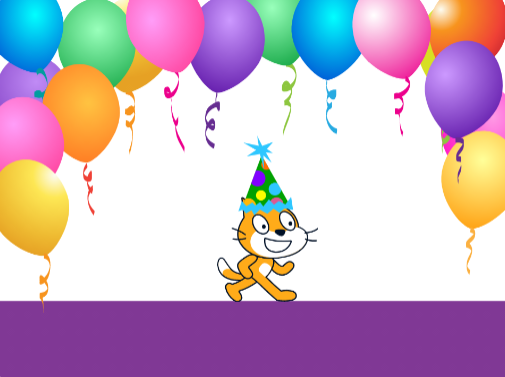

## قائمة تدقيق

هل أطلعت على **project bried**؟ فكر حول مشروعك وانتقل خلال قائمة التدقيق وتحقق من تلك التي يلائم مشروعك.

هل المحاكاة الخاصة بك:

--- task ---

استخدم كائنات متحركة بأحجام مختلفة لتمثيل مسافة الكائن من المشاهد.

--- /task ---

--- task ---

استخدم المستنسخات لتوليد نسخ من الكائنات.

--- /task ---

--- task ---

استخدم لبناتي (My Blocks) للحفاظ على تنظيم التعليمات البرمجية و / أو السماح باستخدام المدخلات.

--- /task ---

يمكن لمحاكاتك أيضًا:

--- task ---

لديك موضوع تعليمي لمحاولة تعليم المستخدم مهارة ما.

--- /task ---

--- task ---

استخدم الأصوات أو الموسيقى لجعل المحاكاة تبدو أكثر واقعية.

--- /task ---

سيساعدك التفكير في كيفية إجراء المحاكاة في مشاريعك المستقبلية:

--- task ---

كيف حصلت على أفكارك؟

--- /task ---

--- task ---

ما الأشياء الجديدة الرائعة التي تعلمتها؟

--- /task ---

كان المخترع الشهير توماس إديسون معتادًا جدًا على ارتكاب الأخطاء. هو قال:
> أنا لم أفشل. بل وجدت 10,000 طريقة لا يمكن للمصباح العمل بها.

و

> العديد من حالات الفشل في الحياة هم أشخاص لم يدركوا مدى قربهم من النجاح عندما استسلموا.

الأخطاء والفشل مؤقتة. استمر حتى تنجح.

--- task ---

ما الأخطاء التي ارتكبتها وكيف ساعدتك في إنشاء المحاكاة أو تحسينها؟

--- /task ---

### أنت الآن مؤلف مرحبًا بك في عالمي!

حان الوقت للاحتفال بما صنعته.

--- task ---

أين ستأخذ طاقتك الجديدة؟ ماذا ستفعل بعد ذلك؟

--- /task ---

