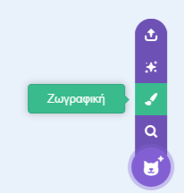
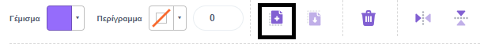
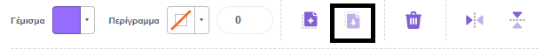
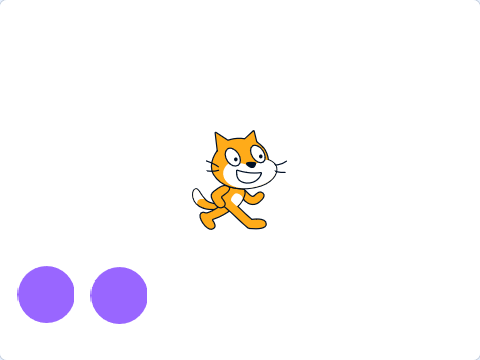
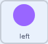
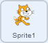

## Δημιουργία και έλεγχος

Τώρα ήρθε η ώρα να φτιάξεις την προσομοίωσή σου. Αρχικά σκέψου το υπόβαθρο της προσομοίωσής σου. Θα έχει κύλιση ή θα είναι στατικό;


**Συμβουλή:** Μην ξεχνάς να δοκιμάζεις το έργο σου κάθε φορά που προσθέτεις κάτι. Είναι πολύ πιο εύκολο να βρεις και να διορθώσεις σφάλματα προτού κάνεις περισσότερες αλλαγές.

--- task ---

Επίλεξε ένα υπόβαθρο για να το χρησιμοποιήσεις για την προσομοίωσή σου. Το υπόβαθρο θα μπορούσε να παραμείνει ακίνητο ή θα μπορούσες να το κάνεις να κυλάει.

--- collapse ---
---
title: Κύλιση σε ένα υπόβαθρο
---

Αντί να κάνεις κύλιση στο υπόβαθρο, στην πραγματικότητα, θα κάνεις κύλιση σε ένα αντικείμενο, το οποίο έχεις δημιουργήσει αντιγράφοντας ένα υπόβαθρο.

Δημιούργησε ένα νέο αντικείμενο αντιγράφοντας τις εικόνες από ένα υπόβαθρο και πρόσθεσέ τις στο αντικείμενό σου.





Δημιούργησε μία νέα `μεταβλητή`{:class="block3variables"} με όνομα `κύλιση_x`{:class="block3variables'}.

Τα ακόλουθα μπλοκ θα δημιουργήσουν ένα εφέ κύλισης στο αντικείμενο όταν το ποντίκι μετακινείται αριστερά και δεξιά.

```blocks3
when flag clicked
go to x: (0) y: (0)
create clone of (εαυτού μου v)
set [κύλιση_x v] to (0)
forever
if <(mouse x) > (200)> then
change [κύλιση_x v] by (5)
end
if <(mouse x) < (-200)> then
change [κύλιση_x v] by (-5)
end
go to x: ((κύλιση_x v) mod (480)) y: (0)

when I start as a clone
forever
go to x: ((κύλιση_x v) mod (-480)) y: (0)
```

**Συμβουλή:** Αντί να χρησιμοποιήσεις τη θέση του ποντικιού, θα μπορούσατε να κάνεις κλικ σε ένα κουμπί ή να πατήσεις ένα πλήκτρο για να αλλάξεις τη μεταβλητή `κύλιση_x`{:class='block3variables'}.

--- /collapse ---

--- /task ---

--- task ---

Σκέψου τα αντικείμενα που θα χρησιμοποιήσεις για την προσομοίωσή σου. Μερικά από αυτά θα παραμείνουν ακίνητα στη σκηνή κάποιοι από αυτούς, θα αλλάξουν ενδυμασίες, εφέ ή κίνηση όταν αλληλεπιδρούν μαζί τους; Θα κάνουν scroll στην οθόνη; Πώς θα ελέγχονται αν κινηθούν;

--- collapse ---
---
title: Μετακίνηση ενός αντικειμένου με πάτημα πλήκτρων
---

```blocks3
when flag clicked
forever
if <key (αριστερό βέλος v) pressed?> then
change x by (-10)
end
if <key (δεξί βέλος v) pressed?> then
change x by (10)
end
```

--- /collapse ---


--- collapse ---
---
title: Μετακίνηση ενός αντικειμένου με χειριστήρια στην οθόνη
---

Δημιούργησε αντικείμενα για τις κατευθύνσεις και τοποθέτησέ τα στην οθόνη.



Τα κουμπιά θα πρέπει να έχουν χειριστήρια για να μεταδίδουν την κατεύθυνσή τους, όταν κάνεις κλικ πάνω τους.


```blocks3
when this sprite clicked
broadcast [αριστερά v]
```

Το υπό έλεγχο αντικείμενο θα πρέπει να κινείται προς την κατεύθυνση που υποδεικνύεται. 
```blocks3
when I receive [αριστερά v]
change x by (-10)
```

--- /collapse ---

--- collapse ---
---
title: Αλλαγή ενός αντικειμένου όταν γίνεται κλικ σε αυτό
---

Μπορείς να αλλάξεις την εμφάνιση και τον προσανατολισμό ενός αντικειμένου κάθε φορά που κάνεις κλικ σε αυτό. Ακολουθούν ορισμένα παραδείγματα κώδικα.

```blocks3
when this sprite clicked
switch costume to [costume 2 v]

when this sprite clicked
change [χρώματος v] effect by (25)

when this sprite clicked
turn cw (30) degrees
```

--- /collapse ---

--- collapse ---
---
title: Κίνηση αντικειμένου με ενδυμασίες
---

Υπάρχουν διάφοροι τρόποι για να ζωντανέψεις ένα αντικείμενο χρησιμοποιώντας τις ενδυμασίες του. Ακολουθούν μερικά παραδείγματα.

```blocks3
when flag clicked
forever
next costume
wait (0.2) seconds

When I receive [δεξιά v]
switch costume to [δεξιά v]
repeat (3)
next costume
wait (0.2) seconds

When this sprite clicked
repeat (3)
next costume
```

--- /collapse ---

--- collapse ---
---
title: Αλλαγή του επιπέδου ενός αντικειμένου
---

Τα αντικείμενα που χρησιμοποιείς ως υπόβαθρα πρέπει να βρίσκονται στο επίπεδο υπόβαθρο. Τα αντικείμενα που θέλεις στο προσκήνιο πρέπει να βρίσκονται στο επίπεδο υπόβαθρο. Μπορείς να ορίσεις το επίπεδο ενός αντικειμένου ή του κλώνου του.

```blocks3
when flag clicked
go to [υπόβαθρο v] layer

when I start as a clone
go to [προσκήνιο v] layer
```

--- /collapse ---

--- /task ---

--- task ---

Θα χρειαστεί κάποιο από τα αντικεέμενά σου να κλωνοποιήσει τον εαυτό του; Θα παράγουν πολλά αντίγραφα που θα εκτελούν διαφορετικές ενέργειες όταν ξεκινήσουν;

--- collapse ---
---
title: Δημιουργία κλώνου ενός αντικειμένου
---
Ακολουθούν μερικοί τρόποι για να δημιουργήσεις κλώνους και να τους διαγράψεις μετά από διαφορετικά συμβάντα.

```blocks3
when flag clicked
repeat (20)
create clone of (εαυτού μου v)

when flag clicked
forever
if <touching (δείκτη ποντικιού v)> then
create clone of (εαυτού μου v)

when I start as a clone
forever
if <touching (edge v)> then
delete this clone
```

--- /collapse ---

--- collapse ---
---
title: Τυχαιοποίησε τους κλώνους σου
---

Όταν δημιουργείται ένας κλώνος, μπορεί να χρειάζεται οδηγίες για το πώς να κινηθεί, αλλά ίσως θέλεις οι διαφορετικοί κλώνοι να συμπεριφέρονται ελαφρώς διαφορετικά. Μπορείς να χρησιμοποιήσεις `τυχαία`{:class='block3operators'} μπλοκ για να το κάνεις αυτό.

```blocks3
when I start as a clone
point in direction (pick random (0) to (359))
forever
move (10) steps
wait (0.1) seconds
if on edge, bounce

when I start as a clone
forever
glide (pick random (1) to (10)) secs to (δείκτη ποντικιού v)
```

--- /collapse ---

--- collapse ---
---
title: Συμβάντα για τη δημιουργία ενός κλώνου
---

Οι κλώνοι μπορούν να δημιουργηθούν με πολλά διαφορετικά `συμβάντα`{:class='block3events'}. Τα παρακάτω μπλοκ θα δημιουργούν ένα κλώνο ενός αντικειμένου κάθε φορά που κάνεις κλικ πάνω του.

```blocks3
when this sprite clicked
create clone of [εαυτού μου v]
```

Μπορείς επίσης να δημιουργείς κλώνους κάθε φορά που κάνεις κλικ στο ποντίκι και να κάνεις τον κλώνο να εμφανίζεται στη θέση του δείκτη του ποντικιού. Οι κλώνοι μπορούν να εμφανιστούν σε οποιαδήποτε τοποθεσία θέλεις, επομένως ίσως θέλεις να πηγαίνουν σε ένα συγκεκριμένο αντικείμενο ή θέση.

```blocks3
when flag clicked
forever
if <mouse down?> then
create clone of [εαυτού μου v]

when I start as a clone
go to x: (mouse x) y: (mouse y)
```

--- /collapse ---

--- /task ---

--- task ---

Θα υπάρχει κάποια μουσική ή ηχητικό εφέ στην προσομοίωσή σου; Ίσως να υπάρχει θόρυβος στο παρασκήνιο ή κάποιο αντικείμενο να παίζει μια μελωδία όταν κάνεις κλικ σε αυτό;

--- collapse ---
---
title: Η επέκταση Μουσική του Scratch
---

Μόλις προσθέσεις την επέκταση, θα είναι διαθέσιμα νέα μπλοκ.

Υπάρχουν τρία κύρια στοιχεία που μπορούν να αλλάξουν μέσα σε αυτά τα μπλοκ.

- `οι παλμοί (τα beats)`{:class='block3custom'} είναι μια μονάδα χρόνου που χρησιμοποιείται στη μουσική. Ένα beat θα μπορούσε να έχει διάρκεια ενός δευτερολέπτου ή ενός τετάρτου του δευτερολέπτου. Εξαρτάται από σένα.

- `o ρυθμός (tempo)`{:class='block3custom'} ορίζει τον αριθμό των beats σε ένα λεπτό: `60` beats ανά λεπτό θα σήμαιναν ότι ένας beat έχει διάρκεια `1` δευτερόλεπτο.

- `νότα`{:class='block3custom'} είναι το ύψος της νότας που παίζεται: `60` είναι το ίδιο με το **μεσαίο Ντο** σε πιάνο.

--- /collapse ---

[[[generic-scratch-sound-from-library]]]

[[[scratch3-record-sound]]]

[[[scratch3-sound-effects]]]

[[[scratch3-reverse-sound]]]

[[[scratch3-crop-sound]]]

--- /task ---

--- task ---

Θέλεις τα αντικείμενά σου να επαναλαμβάνουν συνεχώς μια ενέργεια, μέχρι να ικανοποιηθεί κάποια συνθήκη; Μπορείς να χρησιμοποιήσεις μπλοκ `επανάλαβε ώσπου`{:class='block3operators'} για να το κάνεις αυτό.

--- collapse ---
---
title: Χρήση βρόχων "επανάλαβε ώσπου"
---

Εδώ είναι ένα σύνολο μπλοκ που θα κρατήσουν ένα αντικείμενο σε κίνηση, μέχρι η θέση του `y`{:class='block3motion'} να φτάσει στο `-250`.

```blocks3
when flag clicked
repeat until <(y position) < [-250]>
change y by (-10)
```

--- /collapse ---

--- /task ---


--- task ---

Σκέψου την οργάνωση των μπλοκ σου και τα στοιχεία εισόδου που μπορεί να χρειαστούν. Μπορείς να χρησιμοποιήσεις την κατηγορία `Οι Εντολές μου`{:class="block3myblocks"} για να **βελτιστοποιήσεις** τον κώδικά σου;

--- collapse ---
---
title: Χρήση οι Εντολές μου για οργάνωση του κώδικα
---

Ο απλούστερος λόγος για να χρησιμοποιηθούν `Οι Εντολές μου`{:class="block3myblocks"} είναι για να βοηθηθείς στην οργάνωση του κώδικά σου. Εδώ είναι ένα απλό παράδειγμα.

```blocks3
define μετακίνηση προς τα δεξιά
if <not <touching (edge v) ?>> then
switch costume to [right_1 v]
change x by (2)
switch costume to [right_2 v]
change x by (2)
switch costume to [right_3 v]
change x by (2)
end

define move left
if <not <touching (edge v) ?>> then
switch costume to [left_1 v]
change x by (-2)
switch costume to [left_2 v]
change x by (-2)
switch costume to [left_3 v]
change x by (-2)
end

when flag clicked
forever
if <key (δεξί βέλος v) pressed> then
μετακίνηση προς τα δεξιά
end
if <key (αριστερό βέλος v) pressed> then
move left
```

--- /collapse ---

--- collapse ---
---
title: Χρήση εισόδων με 'Οι Εντολές μου'
---

`Οι Εντολές μου`{:class='block3myblocks'} δέχονται ως είσοδο και κείμενο και αριθμό.

```blocks3
define move (direction) (speed)
if <(direction) = [αριστερά]> then
change x by ((-1) * (speed))
end
if <(direction) = [δεξιά]> then
change x by ((1) * (speed))

when flag clicked
if <(mouse x) < (-200)> then
move [αριστερά] (speed)
end
if <(mouse x) > (200)> then
move [δεξιά] (speed)
```

--- /collapse ---

--- /task ---

--- task ---

Το κλειδί για τις περισσότερες σκηνές 2.5D είναι η αλλαγή του μεγέθους ενός αντικειμένου για να δώσει την εντύπωση ότι βρίσκεται πιο μακριά.

--- collapse ---
---
title: Αλλαγή μεγεθών αντικειμένου σε σχέση με τη θέση
---

Τα ακόλουθα μπλοκ θα κάνουν ένα αντικείμενο μικρότερο καθώς κινείται προς τα πάνω στην οθόνη και επομένως θα εμφανίζεται πιο μακριά.

```blocks3
when flag clicked
forever
change y by (10)
change size by (-3)
wait (0.2) secs
```

--- /collapse ---

--- /task ---


--- task ---

**Δοκιμή:** Δείξε σε κάποιον άλλο το έργο σου και ζήτησε τα σχόλιά του. Θέλεις να κάνεις αλλαγές στο σκηνικό σου;

--- /task ---

--- task ---

**Εντοπισμός σφαλμάτων:** Ενδέχεται να βρεις κάποια σφάλματα στο έργο σου που πρέπει να διορθώσεις. Εδώ είναι μερικά συνηθισμένα σφάλματα.

--- collapse ---
---
title: Οι κλώνοι μου δεν εμφανίζονται
---

Είναι κρυμμένοι οι κλώνοι σου; Βεβαιώσου ότι κατά τη δημιουργία των κλώνων, χρησιμοποιείται η επιλογή `εμφανίσου`{:class='block3looks'}. Επίσης, βεβαιώσου ότι τα έχεις στο επίπεδο `προσκήνιο`{:class='block3looks'}.


--- /collapse ---

--- collapse ---
---
title: Το αντικείμενό μου δεν μετακινείται σωστά στην οθόνη
---

Αν θέλεις ένα αντικείμενο να μετακινείται από τη μία πλευρά της οθόνης στην άλλη ή να εξαφανίζεται όταν φτάνει στη μία πλευρά της οθόνης, τότε μπορείς να ελέγξεις τη θέση του και να εκτελέσεις κάποια ενέργεια. Ίσως χρειαστεί να ελέγξεις πού βρίσκεται το κέντρο του αντικειμένου σου, στην ενδυμασία του, για να βεβαιωθείς ότι λειτουργεί σωστά. Είναι πιο εύκολο να σύρεις το αντικείμενο στο πλάι της οθόνης και, στη συνέχεια, να ελέγξεις τις θέσεις του `x`{:class='block3motion'} και `y`{:class='block3motion'}.


--- /collapse ---

--- collapse ---
---
title: Οι Εντολές μου δεν λειτουργούν
---

Έχεις ελέγξει ότι χρησιμοποιείς το νέο σου μπλοκ κάπου στον κώδικά σου. Μπορείς να `ορίσεις`{:class='block3myblocks'} ένα νέο μπλοκ, αλλά στη συνέχεια πρέπει να το χρησιμοποιήσεις για να εκτελεστεί ο κώδικας από κάτω.

--- /collapse ---

--- collapse ---
---
title: Οι κλώνοι μου δεν κάνουν τίποτα
---

Χρησιμοποιείς το μπλοκ `όταν ξεκινάω ως κλώνος`{:class='block3control'}, για να κατευθύνεις τον κλώνο τι να κάνει;

Υπάρχουν συνθήκες που μπορεί να εμποδίσουν τους κλώνους να λειτουργήσουν; Για παράδειγμα, υποτίθεται ότι πρέπει να κινούνται μέχρι να αγγίξουν την άκρη της οθόνης; Αν δημιουργηθεί ένας κλώνος στην άκρη της οθόνης, τότε δεν θα κάνουν τίποτα.


--- /collapse ---

--- collapse ---
---
title: Τα αντικείμενά μου κινούνται προς λάθος κατεύθυνση
---

Έλεγξε ότι χρησιμοποιείς το μπλοκ `άλλαξε x κατά`{:class='block3motion'} για να μετακινήσεις τα αντικείμενα αριστερά και δεξιά, και το μπλοκ `άλλαξε y κατά`{:class='block3motion'} για να τα μετακινήσεις πάνω και κάτω.

Έλεγξε αν χρησιμοποιείς σωστά θετικούς και αρνητικούς αριθμούς, για να αυξήσεις ή να μειώσεις το `x`{:class='block3motion'} και `y`{:class='block3motion'}.

--- /collapse ---

Πιθανόν να βρεις ένα σφάλμα που δεν αναφέρεται εδώ. Μπορείς να σκεφτείς πώς θα το λύσεις;

Μας αρέσει να μαθαίνουμε για τα σφάλματα που εντοπίζετε και πώς τα διορθώνετε. Χρησιμοποίησε την Αποστολή σχολίων στο κάτω μέρος αυτής της σελίδας και πες μας αν εντόπισες κάποιο διαφορετικό σφάλμα στο έργο σου.

--- /task ---

--- save ---
