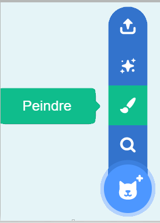
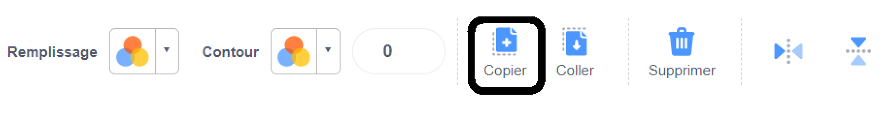
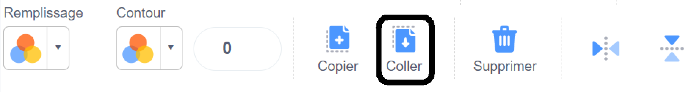
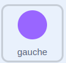

## Construire et tester

Maintenant, il est temps de créer ta simulation. Commence par réfléchir à l'arrière-plan de ta simulation. Va-t-il défiler ou sera-t-il statique ?


**Astuce ** : N'oublie pas de tester ton projet à chaque fois que tu ajoutes quelque chose. Il est beaucoup plus facile de trouver et de corriger les bogues avant d'apporter d'autres modifications.

--- task ---

Choisis un arrière-plan à utiliser pour ta simulation. L'arrière-plan pourrait rester immobile ou tu pourrais le faire défiler.

--- collapse ---
---
title : Faire défiler un arrière-plan
---

Plutôt que de faire défiler l'arrière-plan, en fait, tu vas faire défiler un sprite, que tu as créé en copiant un arrière-plan.

Crée un nouveau sprite en copiant les images d'un arrière-plan et en les ajoutant à ton sprite.

  

Crée une nouvelle `variable`{:class="block3variables"} appelée `défiler_x`{:class="block3variables'}.

Les blocs suivants créeront un effet de défilement sur le sprite lorsque la souris est déplacée vers la gauche et vers la droite.

```blocks3
when flag clicked
go to x: (0) y: (0)
create clone of (myself v)
set [scroll_x v] to (0)
forever
if <(mouse x) > (200)> then
change [scroll_x v] by (5)
end
if <(mouse x) < (-200)> then
change [scroll_x v] by (-5)
end
go to x: ((scroll_x v) mod (480)) y: (0)

when I start as a clone
forever
go to x: ((scroll_x v) mod (-480)) y: (0)
```

**Astuce :** Au lieu d'utiliser la position de la souris, tu peux cliquer sur un bouton ou appuyer sur une touche pour modifier la variable `défiler_x`{:class='block3variables'}.

--- /collapse ---

--- /task ---

--- task ---

Pense aux sprites que tu vas utiliser pour ta simulation. Certains d'entre eux resteront-ils immobiles dans la scène, changeront-ils de costumes, d'effets ou de mouvement lorsque quelqu'un interagit avec eux ? Vont-ils défiler sur l'écran ? Comment seront-ils contrôlés s'ils bougent ?

--- collapse ---
---
title : Déplacer un sprite en appuyant sur les touches
---

```blocks3
when flag clicked
forever
if <key (left arrow v) pressed?> then
change x by (-10)
end
if <key (right arrow v) pressed?> then
change x by (10)
end
```

--- /collapse ---


--- collapse ---
---
title : Déplacer un sprite avec les commandes à l'écran
---

Crée des sprites pour tes directions et positionne-les sur l'écran.


Les boutons doivent avoir des commandes pour transmettre les directions lorsqu'ils sont cliqués.


```blocks3
when this sprite clicked
broadcast [left v]
```

Le sprite contrôlé doit se déplacer dans la direction indiquée. 
```blocks3
when I receive [left v]
change x by (-10)
```

--- /collapse ---

--- collapse ---
---
title : Changer un sprite lorsqu'il est cliqué
---

Tu peux modifier l'apparence et l'orientation d'un sprite chaque fois que tu cliques dessus. Voici quelques exemples de code.

```blocks3
when this sprite clicked
switch costume to [costume 2 v]

when this sprite clicked
change [color v] effect by (25)

when this sprite clicked
turn cw (30) degrees
```

--- /collapse ---

--- collapse ---
---
title : Animer un sprite avec des costumes
---

Il existe plusieurs manières d'animer un sprite en utilisant ses costumes. Voici quelques exemples .

```blocks3
when flag clicked
forever
next costume
wait (0.2) seconds

When I receive [right v]
switch costume to [right v]
repeat (3)
next costume
wait (0.2) seconds

When this sprite clicked
repeat (3)
next costume
```

--- /collapse ---

--- collapse ---
---
title : Changer le plan d'un sprite
---

Les sprites que tu utilises comme arrière-plan doivent se trouver sur le plan arrière. Les sprites que tu veux au premier plan doivent être sur le plan avant. Tu peux définir le plan d'un sprite ou de son clone.

```blocks3
when flag clicked
go to [back v] layer

when I start as a clone
go to [front v] layer
```

--- /collapse ---

--- /task ---

--- task ---

Certains de tes sprites auront-ils besoin de se cloner ? Vont-ils produire de nombreuses copies qui effectuent différentes actions lorsqu'ils démarrent ?

--- collapse ---
---
title: Créer des clones d'un sprite
---
Voici quelques façons de créer des clones et de les supprimer après différents événements.

```blocks3
when flag clicked
repeat (20)
create clone of (myself v)

when flag clicked
forever
if <touching (mouse-pointer v)> then
create clone of (myself v)

when I start as a clone
forever
if <touching (edge v)> then
delete this clone
```

--- /collapse ---

--- collapse ---
---
title: Randomise tes clones
---

Lorsqu'un clone est créé, il peut avoir besoin d'instructions sur la façon de se déplacer, mais tu souhaiteras peut-être que les différents clones se comportent légèrement différemment. Pour cela, tu peux utiliser des blocs ` aléatoires`{:class='block3operators'}.

```blocks3
when I start as a clone
point in direction (pick random (0) to (359))
forever
move (10) steps
wait (0.1) seconds
if on edge, bounce

when I start as a clone
forever
glide (pick random (1) to (10)) secs to (mouse-pointer v)
```

--- /collapse ---

--- collapse ---
---
title : Événements pour créer un clone
---

Les clones peuvent être créés avec de nombreux `événements`{:class='block3events'} différents. Les blocs ci-dessous vont créer un clone d'un sprite à chaque fois qu'on clique dessus.

```blocks3
when this sprite clicked
create clone of [myself v]
```

Tu peux également créer des clones chaque fois que tu cliques sur la souris et faire apparaître le clone à l'emplacement du pointeur de la souris. Les clones peuvent apparaître à n'importe quel endroit de ton choix, et donc tu voudras peut-être qu'ils aillent vers un sprite ou une position spécifique.

```blocks3
when flag clicked
forever
if <mouse down?> then
create clone of [myself v]

when I start as a clone
go to x: (mouse x) y: (mouse y)
```

--- /collapse ---

--- /task ---

--- task ---

Y aura-t-il un aspect musical ou sonore dans ta simulation ? Peut-être y a-t-il un bruit de fond, ou un sprite joue-t-il une mélodie quand on clique dessus ?

--- collapse ---
---
title: L'extension musicale Scratch
---

Une fois que tu as ajouté l'extension, tu pourras accéder de nouveaux blocs.

Trois éléments principaux peuvent être modifiés dans ces blocs.

- `battements`{:class='block3custom'} est une unité de temps utilisée en musique. Un battement peut durer une seconde ou un quart de seconde. C'est toi qui décides.

- `tempo`{:class='block3custom'} définit le nombre de battements qu'il y a dans une minute : `60` battements par minute signifieraient qu'un battement dure `1` secondes.

- `note`{:class='block3custom'} est la hauteur de la note jouée : `60` équivaut à **do moyen** sur un piano.

--- /collapse ---

[[[generic-scratch-sound-from-library]]]

[[[scratch3-record-sound]]]

[[[scratch3-sound-effects]]]

[[[scratch3-reverse-sound]]]

[[[scratch3-crop-sound]]]

--- /task ---

--- task ---

Veux-tu que tes sprites continuent à répéter une action jusqu'à ce qu'une condition soit remplie ? Pour cela, tu peux utiliser des blocs `répéter jusqu'à ce que`{:class='block3control'}.

--- collapse ---
---
title : Utiliser les blocs répéter jusqu'à ce que
---

Voici un ensemble de blocs qui maintiendront un sprite en mouvement, jusqu'à ce que sa position `y`{:class='block3motion'} atteigne `-250`.

```blocks3
when flag clicked
repeat until <(y position) < [-250]>
change y by (-10)
```

--- /collapse ---

--- /task ---


--- task ---

Pense à l'organisation de tes blocs et aux données d'entrée qui pourraient être nécessaires. Peux-tu utiliser `Mes Blocks`{:class='block3myblocks'} pour **améliorer** ton projet ?

--- collapse ---
---
title: Utiliser Mes blocs pour organiser le code
---

La façon la plus simple d'utiliser `Mes Blocs`{:class="block3myblocks"} est d'aider à organiser ton code. Voici un exemple simple.

```blocks3
define move right
if <not <touching (edge v) ?>> then
switch costume to [right_1 v]
change x by (2)
switch costume to [right_2 v]
change x by (2)
switch costume to [right_3 v]
change x by (2)
end

define move left
if <not <touching (edge v) ?>> then
switch costume to [left_1 v]
change x by (-2)
switch costume to [left_2 v]
change x by (-2)
switch costume to [left_3 v]
change x by (-2)
end

when flag clicked
forever
if <key (right arrow v) pressed> then
move right
end
if <key (left arrow v) pressed> then
move left
```

--- /collapse ---

--- collapse ---
---
title : Utiliser des données d’entrée avec Mes blocs
---

`Mes blocs`{:class='block3myblocks'} acceptent également des données d’entrée de texte et de chiffres.

```blocks3
define move (direction) (speed)
if <(direction) = [left]> then
change x by ((-1) * (speed))
end
if <(direction) = [right]> then
change x by ((1) * (speed))

when flag clicked
if <(mouse x) < (-200)> then
move [left] (speed)
end
if <(mouse x) > (200)> then
move [right] (speed)
```

--- /collapse ---

--- /task ---

--- task ---

Le secret de la plupart des scènes 2.5D est de changer la taille d'un sprite pour donner l'impression qu'il est plus éloigné.

--- collapse ---
---
title : Changer la taille des sprites en fonction de la position
---

Les blocs suivants rendront un sprite plus petit à mesure qu'il se déplace vers le haut de l'écran, et donc le fera apparaître plus loin.

```blocks3
when flag clicked
forever
change y by (10)
change size by (-3)
wait (0.2) secs
```

--- /collapse ---

--- /task ---


--- task ---

**Test :** Montre ton projet à quelqu'un et demande-lui son avis. Souhaites-tu apporter des modifications à ta scène ?

--- /task ---

--- task ---

**Débogage :** Il est possible que tu trouves des bogues dans ton projet que tu dois corriger. Voici quelques bogues assez courants.

--- collapse ---
---
title: Mes clones n'apparaissent pas
---

Tes clones sont-ils cachés ? Assure-toi que lorsque les clones sont créés, l'option `montrer`{:class='block3looks'} est utilisée. Assure-toi également que tu les as sur l'`avant plan`{:class='block3looks'}.


--- /collapse ---

--- collapse ---
---
title : Mon sprite ne sort pas correctement de l'écran
---

Si tu veux qu'un sprite passe d'un côté à l'autre de l'écran, ou disparaisse lorsqu'il arrive d'un côté de l'écran, tu peux vérifier sa position et effectuer une action. Tu devras peut-être vérifier où se trouve le centre de ton sprite, sur son costume, pour t'assurer que cela fonctionne correctement. Il est plus facile de faire glisser le sprite sur le côté de l'écran, puis de vérifier ses positions `x`{:class='block3motion'} et `y`{:class='block3motion'}.


--- /collapse ---

--- collapse ---
---
title : Mes blocs ne fonctionnent pas
---

As-tu vérifié que tu utilises ton nouveau bloc quelque part dans ton code. Tu peux `définir`{:class='block3myblocks'} un nouveau bloc, mais tu dois ensuite l'utiliser pour que le code en dessous s'exécute réellement.

--- /collapse ---

--- collapse ---
---
title : Mes clones ne font rien
---

Utilise-tu le bloc `quand je commence comme un clone`{:class='block3control'}, pour dire au clone quoi faire ?

As-tu des conditions qui pourraient empêcher les clones de fonctionner ? Par exemple, sont-ils censés bouger jusqu'à ce qu'ils touchent le bord de l'écran ? Si un clone est créé au bord de l'écran, il ne fera rien.


--- /collapse ---

--- collapse ---
---
title: Mes sprites pointent dans la mauvaise direction
---

Vérifie que tu utilises le bloc `ajouter à x`{:class='block3motion'} pour déplacer les sprites vers la gauche et la droite, et le bloc `ajouter à y`{:class='block3motion'} pour les déplacer vers le haut et le bas.

Vérifie que tu utilises correctement les nombres positifs et négatifs, pour augmenter ou diminuer `x`{:class='block3motion'} et `y`{:class='block3motion'}.

--- /collapse ---

Tu pourrais trouver un bogue qui n'est pas répertorié ici. Peux-tu trouver comment le réparer ?

Nous aimons avoir des nouvelles de tes bogues et de la façon dont tu les as corrigés. Utilise le bouton de commentaires au bas de cette page si tu as trouvé un bogue différent dans ton projet.

--- /task ---

--- save ---
