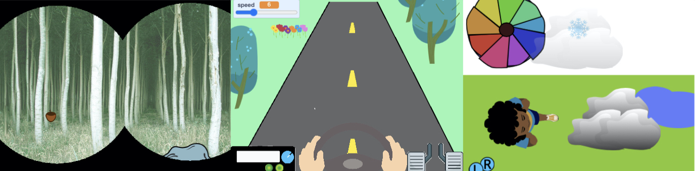

## A sua ideia

Use esta etapa para planejar seu ambiente virtual 

### O que você vai fazer?

--- task ---

Pense sobre a simulação que você deseja criar e como o usuário irá interagir com o projeto.

Pode ser:
- Uma simulação da natureza com controles na tela para se movimentar pela cena
- Um cômodo em uma casa onde diferentes atores, como uma TV, podem ser clicados para fazê-los funcionar
- A vehicle simulator with a steering wheel, pedals, and a gearstick

--- /task ---

### Who is it for?

--- task ---

Think about who you will make your simulation for (your **audience**). Is it an educational simulation to teach people? Is it a game for entertainment? Maybe it's a series of puzzles that need to be solved.

--- /task ---

### Get started

--- task ---

Open a [new Scratch project](http://rpf.io/scratch-new){:target="_blank"}. Scratch will open in another browser tab.

--- collapse ---
---
title: Working offline
---

To set up Scratch for offline use, visit [our Scratch guide](https://learning-admin.raspberrypi.org/en/projects/getting-started-scratch/1){:target="_blank"}.

--- /collapse ---

Use a notes app or pen and paper, or both to plan ideas for your simulation. Try to jot down as many ideas as you can, and discuss them with a friend. Then pick the idea that you like the most.

--- /task ---

--- task ---

This simulation is going to need quite a few graphics. How will you get the images you need to build your project? You could:

1. Use the sprites and backdrops that already exist in Scratch
2. Use the tools in Scratch to draw your own sprites and backdrops
3. Download images from websites and then upload them to Scratch

Here are some ingredients that you might find useful:

[[[scratch3-paint-a-new-backdrop-extended]]]

[[[scratch3-copy-parts-between-sprite-costumes]]]

[[[scratch3-backdrops-and-sprites-using-shapes]]]

--- /task ---

--- save ---
